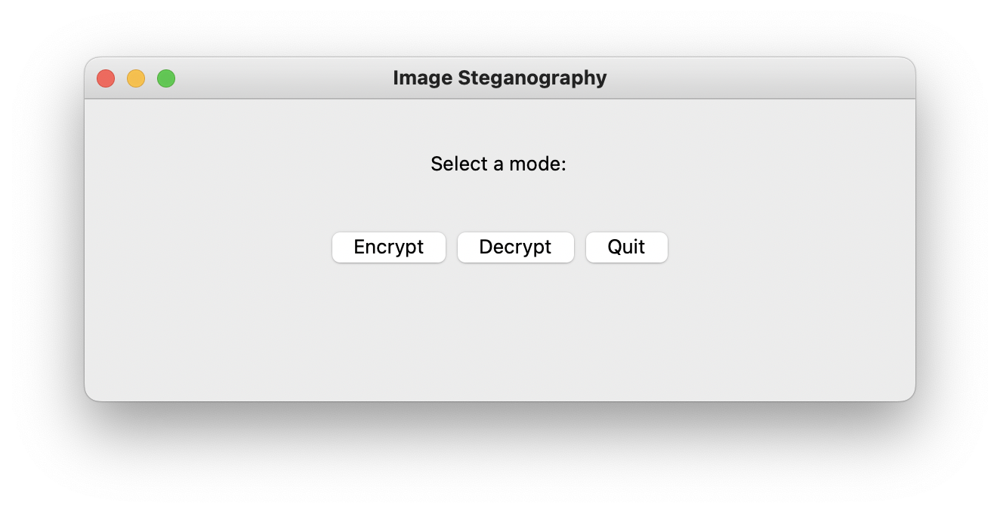
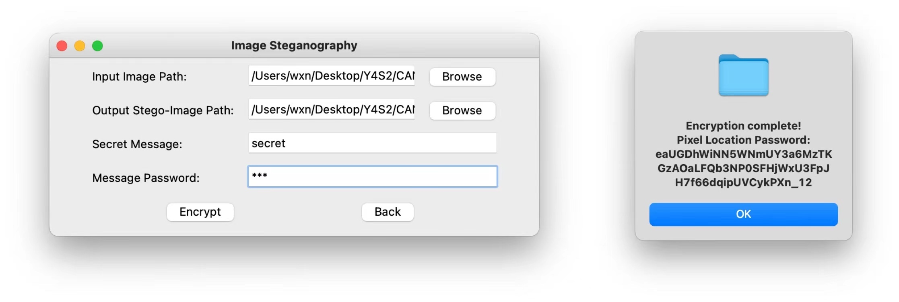
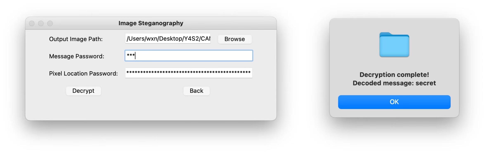

# PIPLUP Pixel-location Image Password for LSB-Steganography UI Program

## Dependencies

```sh
pip install Pillow pyaes numpy pycryptodome pbkdf2 fire opencv-python
```
# CLI

## Example Encryption

cli.py encrypt - Encrypt a secret message into an input image using AES and LSB-Steganography.

### Usage

```sh
python cli.py encrypt INPUT_IMAGE_PATH OUTPUT_IMAGE_PATH MESSAGE MESSAGE_PASSWORD
```

### Description

Encrypt a secret message into an input image using AES and LSB-Steganography.

### Positional Arguments

- INPUT_IMAGE_PATH: Input image's file path.   
- OUTPUT_IMAGE_PATH: Output stego-image's file path. 
- MESSAGE: Secret message to conceal.
- MESSAGE_PASSWORD: Password to encrypt the secret message with.

### Example

```sh
(base) PIPLUP % python cli.py encrypt demo/in.png demo/out.png 'Some longer secret message' 'Somepass123WithSymbols!'

["vMAUkraiYAydNmoL5otFk9hvVOdA0zo6q9C9Hd4sZqIavqaVh4tEV54H8rnMvyAH", 52]
```


## Example Decryption

cli.py decrypt - Decrypt a secret message from an input stego-image using AES and LSB-Steganography.

### Usage

```sh
python cli.py decrypt OUTPUT_IMAGE_PATH MESSAGE_PASSWORD PIXEL_LOCATION_PASSWORD LEN_ENCODED_MESSAGE
```

### Description

Decrypt a secret message from an input stego-image using AES and LSB-Steganography.

### Positional Arguments

- OUTPUT_IMAGE_PATH: Input stego-image's file path.
- MESSAGE_PASSWORD: Password used to encrypt the secret message.
- PIXEL_LOCATION_PASSWORD: Password for pixel locations.
- LEN_ENCODED_MESSAGE: Length of the encoded message.

### Example

```sh
(base) PIPLUP % python cli.py decrypt demo/out.png 'Somepass123WithSymbols!' 'vMAUkraiYAydNmoL5otFk9hvVOdA0zo6q9C9Hd4sZqIavqaVh4tEV54H8rnMvyAH' 52 

Some longer secret message
```

## GUI Program
The graphical user interface (GUI) for the PIPLUP program.
### Usage

```sh
python gui.py
```


